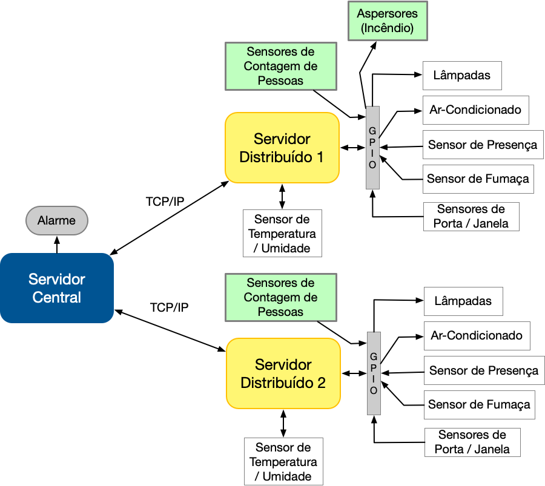
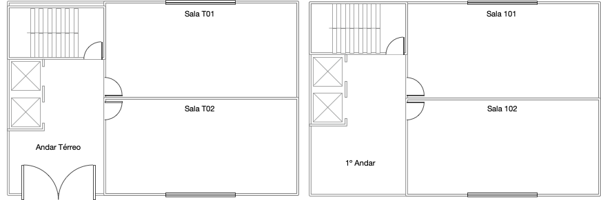

# Trabalho 2 (2021-1)

## Instalação

**Servidor central**

1. Entre na pasta ```central```

2. Rode o comando ```make all```

**Servidor distribuído**

1. Entre na pasta ```distributed```

2. Rode o comando ```make all```

## Execução

**Servidor central**

1. Entre na pasta ```central```

2. Rode o comando ```make run```

**Servidor distribuído**

1. Entre na pasta ```distributed```

2. Rode o comando ```make run```

## Modo de uso

Siga as instruções em tela =)

<hr>

# Enunciado

Trabalho 2 da disciplina de Fundamentos de Sistemas Embarcados (2021/2)

## 1. Objetivos

Este trabalho tem por objetivo a criação de um sistema distribuído de automação predial para monitoramento e acionamento de sensores e dispositivos de um prédio de 2 andares. O sistema deve ser desenvolvido para funcionar em um conjunto de placas Raspberry Pi com um servidor central responsável pelo controle e interface com o usuário e servidores distribuídos para leitura e acionamento dos dispositivos. Dentre os dispositivos envolvidos estão o monitoramento de temperatura e umidade, sensores de presença, sensores de fumaça, sensores de contagem de pessoas, sensores de abertura e fechamento de portas e janelas, acionamento de lâmpadas, aparelhos de ar-condicionado, alarme e aspersores de água em caso de incêndio.

A Figura 1 mostra a arquitetura do sistema.



Na Figura 2 é possível ver a distribuição dos sensores no prédio.



## 2. Componentes do Sistema

Para simplificar a implementação e logística de testes do trabalho, a quantidade de salas do prédio e o número de sensores foi reduzido a um mínimo representativo. Além disso, trabalharemos com 2 placas Raspberry Pi, uma para rodar o software do Servidor Central e outra para rodar 2 instâncias (uma por andar) do Servidor Distribuído conforme as especificações abaixo:

O sistema do Servidor Central será composto por:
1. 01 placa Raspberry Pi 4;

O sistema do Servidor Distribuído será composto por:
1. 01 Placa Raspberry Pi 4;
2. 02 Sensores de Temperatura (DHT22)
3. 01 Circuito de potência com 9 relés para acionametno de Lâmpadas / Aparelhos de Ar-Condicionado, etc.;
4. 04 Sensores de fechamento de portas/janelas;
5. 02 Sensores de presença;
6. 02 Sensores de fumaça;
7. 04 Sensores de Contagem de Pessoas (Cada pessoa que passa aciona o sinal do sensor por aprox. 200 ms, são 2 sensores por andar);
8. 01 Aspersor de água (Incêndio).

## 3. Conexões entre os módulos do sistema

1. Os servidores distribuídos deverão se comunicar com o servidor central através do Protocolo TCP/IP (O formato das mensagens ficam à cargo do aluno. A sugestão é o uso do formato JSON);
2. Cada instância do servidor distribuído (uma por andar) deve rodar em um processo paralelo em portas distintas); 
3. O alarme do servidor Central deverá ser acionado indicando na tela do sistema que o mesmo está acionado;
4. Os 2 sensores de temperatura / umidade (DHT22) estão conectados diretamete às portas **GPIO 20** e **GPIO 21** da placa Raspberry Pi do Servidor Distribuído;
5. As lâmpadas, aparelhos de ar-condicionado e os diversos sensores estão ligados aos pinos da GPIO conforme a Tabela 1.

| Item                                              | Sigla | GPIO | Direção |
|---------------------------------------------------|:------:|:----:|:-------:|
| ***Andar Terreo***                                |        |      |         |
| Lâmpada da Sala T01                               | LS_T01 |  04  | Saída   |
| Lâmpada da Sala T02                               | LS_T02 |  17  | Saída   |
| Lâmpadas do Corredor Terreo                       | LC_T   |  27  | Saída   |
| Ar-Condicionado Terreo                            | AC_T   |  07  | Saída   |
| Sensor de Presença                                | SP_T   |  26  | Entrada |
| Sensor de Fumaça                                  | SF_T   |  23  | Entrada |
| Sensor de Janela T01                              | SJ_T01 |  09  | Entrada |
| Sensor de Janela T02                              | SJ_T02 |  11  | Entrada |
| Sensor de Porta Entrada                           | SPo_T  |  10  | Entrada |
| Sensor de Contagem de Pessoas Entrando no Prédio  | SC_IN  |  13  | Entrada |
| Sensor de Contagem de Pessoas Saindo do Prédio    | SC_OUT |  19  | Entrada |
| Aspersores de Água (Incêndio)                     | ASP    |  16  | Saída   |
| ***Primeiro Andar***                              |        |      |         |
| Lâmpada da Sala 101                               | LS_101 |  22  | Saída   |
| Lâmpada da Sala 102                               | LS_102 |  25  | Saída   |
| Lâmpadas do Corredor                              | LC_1   |  08  | Saída   |
| Ar-Condicionado (1º Andar)                        | AC_1   |  12  | Saída   |
| Sensor de Presença                                | SP_1   |  18  | Entrada |
| Sensor de Fumaça                                  | SF_1   |  24  | Entrada |
| Sensor de Janela 101                              | SJ_1   |  05  | Entrada |
| Sensor de Janela 102                              | SJ_1   |  06  | Entrada |
| Sensor de Contagem de Pessoas Entrando no Prédio  | SC_IN_2  |  02  | Entrada |
| Sensor de Contagem de Pessoas Saindo do Prédio    | SC_OUT_2 |  03  | Entrada |

## 4. Requisitos

Os sistema de controle possui os seguintes requisitos:

### Servidor Central

O código do Servidor Central pode ser desenvolvido em **Python**, **JavaScript**, **C** ou **C++**. Em qualquer uma das linguagens devem haver instruções explicitas de como instalar e rodar. No caso de uso de algum framework (Node, npm, etc.) será necessário entregar a solução dockerizada e automática para rodar. Para C/C++ basta o Makefile e incluir todas as dependências no próprio projeto.

O servidor central tem as seguintes responsabilidades:  
1. Manter conexão com o servidor distribuído (TCP/IP);  
2. Prover uma **interface** que mantenham atualizadas as seguintes informações:  
    a. **Estado das entradas** (Sensores);  
    b. **Estado das Saídas** (lâmpadas, aparelhos de ar, etc.);   
    c. **Valor da temperatura e umidade** de cada andar a cada 1 segundo;  
    d. **Contador de Ocupação** (Número de Pessoas) presentes no prédio como um todo e um contador específico por andar (Serão 3 contadores separados);  
3. Prover **mecanismo na interface** para:  
    a. Acionar manualmente lâmpadas e aparelhos de ar-condicionado;   
    b. **Acionamento de uma alarme** que, quando estiver ligado, deve tocar um som de alerta ao detectar presenças ou abertura de portas/janelas;  
    c. **Acionamento de alarme de incêncio** que, ao detectar presença de fumaça a qualaquer momento deve soar o alarme e acionar os aspersores de incêndio;
4. Manter **log** (em arqvuio CSV) dos comandos acionados pelos usuários e do acionamento dos alarmes com data e hora e cada evento;  

### Servidores Distribuídos

O código do Servidor Distribuído deve ser desenvolvido em **C** ou **C++**;  

Os servidores distribuídos tem as seguintes responsabilidades:  
1. Manter os valores de **temperatura e umidade** atualizados a cada 1 segundo (Sendo requisitado pelo servidor central periodicamente ou enviado via mensagem *push*);  
2. Acionar **Lâmpadas, aparelhos de Ar-Condicionado e os Aspersores de Incêndio** (mantendo informação sobre seu estado) conforme comandos do Servidor Central e retornando uma mensagem de confirmação para o mesmo sobre o sucesso ou não do acionamento;  
3. Manter o estado dos **sensores de presença e abertura de portas/janelas** informando ao servidor central imediatamente (*mensagem push*) quando detectar o acionamento de qualquer um deles;  
4. Manter o estado dos **sensores de fumaça** informando ao servidor central imediatamente (*mensagem push*) quando detectar o acionamento de qualquer um deles;  
5. Efetuar a contagem de pessoas entrando e saindo do prédio e de cada andar para controle de ocupação;
6. Cada instância dos servidores distribuídos deve ser iniciada conforme o arquivo descrição JSON disponível neste repositório (Somente a porta local de cada servidor deve ser modificada no arquivo para cada aluno conforme a distribuição de portas disponibilizada para a turma).

### Geral

1. Os códigos em C/C++ devem possuir Makefile para compilação;
2. Cada serviço (programa) deve poder ser iniciado independente dos demais e ficar aguardando o acionamento dos demais;
3. Deverá haver um arquivo README no repositório descrevento o modo de instalação/execução e o modo de uso do programa.

## 5. Detalhes de Implementação

1. Os sensores de contagem de pessoas serão acionados por aprox. 200 ms (podendo variar em aprox. 100 ms para mais ou para menos). Neste caso, o sistema deverá detectar e contar corretamente somente uma entrada ou saída.
2. O programa não poderá usar 100% da CPU em nenhum caso. Todas as threads/processos deverão funcionar com algum tipo de temporizador ou sleep para desocupar o processador em algum momento ou através de chamadas blocantes.
3. O programa do Servidor Distribuído deve ser genérico para poder ser associado a qualquer andar do prédio e inicializado à partir de um arquivo de configuração (JSON), disponível neste repositório.
4. Os sensores de presença nos corredores terão duas funções:  
   a. Caso o alarme esteja ligado, deverão acionar o alarme;  
   b. Caso o alrme esteja desligado, deverão acender a lâmpada do respectivo corredor por 15 segundos e depois apagar;
5. Deve haver um meio de ligar e desligar todas as cargas do prédio ou por andar. Neste caso são 6 comandos. (Liga/Desliga todo o prédio e Liga/Desliga todas as cargas -- Lampadas e aparelhos de Ar-Condicionado -- de um determinado andar).
6. Ao acionar o alarme, deve haver uma verificação se o sensores que ativam o alarme estão ligados. Neste caso, o sistema deve alertar o usuário e não permitir o acionamento do alarme enquanto todos os itens que o acionam estejam desativados.

## 6. Critérios de Avaliação

A avaliação será realizada seguindo os seguintes critérios:

|   ITEM    |   DETALHE  |   VALOR   |
|-----------|------------|:---------:|
|**Servidor Central**    |       |       |
|**Interface (Monitoramento)**  |   Interface gráfica (via terminal, web, etc) apresentando o estado de cada dispositivo (entradas e saídas), a temperatura, umidade e o número de pessoas ocupando o prédio sendo atualizada periodicamente.  |   1,0   |
|**Interface (Acionamento de Dispositivos)** |   Mecanismo para acionamento de lâmpadas e aparelhos de ar-condicionado individualmente ou em grupos. |   1,0   |
|**Acionamento do Alarme**   |   Mecanismo de ligar/desligar alarme e acionamento do alarme de acordo com o estado dos sensores com alerta no acionamento. |   0,5   |
|**Alarme de Incêndio**   |   Implementação da rotina de acionamento do alarme de incêncio com o correto acionamento dos aspersores. |   0,5   |
|**Log (CSV)**   |   Geração de Log em arquivo CSV.  |   0,5 |
|**Servidores Distribuídos**    |       |       |
|**Inicialização (Arquivo de Configuração)**    |   Correta inicialização do serviço à partir do arquivo de configuração JSON.  |   0,5   |
|**Leitura de Temperatura / Umidade**    |   Leitura, armazenamento e envio dos valores de temperatura / umidade por andar.  |   0,7   |
|**Acionamento de Dispositivos** |   Correto acionamento de lâmpadas, aparelhos de ar-condicionado e aspersor pelo comando do Servidor Central.    |   0,7   |
|**Estado dos Sensores** |   Correta leitura e envio (*mensagem push*) para o Servidor Central um alerta pelo acionamento dos sensores de presença / abertura de portas/janelas e sensor de fumaça.   |   0,8  |
|**Contagem de pessoas** |   Correta leitura dos sensores de contagem de pessoas (Por andar e Total).   |   0,8  |
|**Geral**    |       |       |
|**Comunicação TCP/IP**  |   Correta implementação de comunicação entre os servidores usando o protocolo TCP/IP, incluindo as mensagens do tipo *push*. |   1,5   |
|**Qualidade do Código / Execução** |   Utilização de boas práticas como o uso de bons nomes, modularização e organização em geral, bom desempenho da aplicação sem muito uso da CPU. |  1,5 |
|**Pontuação Extra** |   Qualidade e usabilidade acima da média. |   0,5   |

## 7. Referências

[Biblioteca BCM2835 - GPIO](http://www.airspayce.com/mikem/bcm2835/)

[Exemplo de uso do DHT22](https://github.com/nebulx29/dht22)
